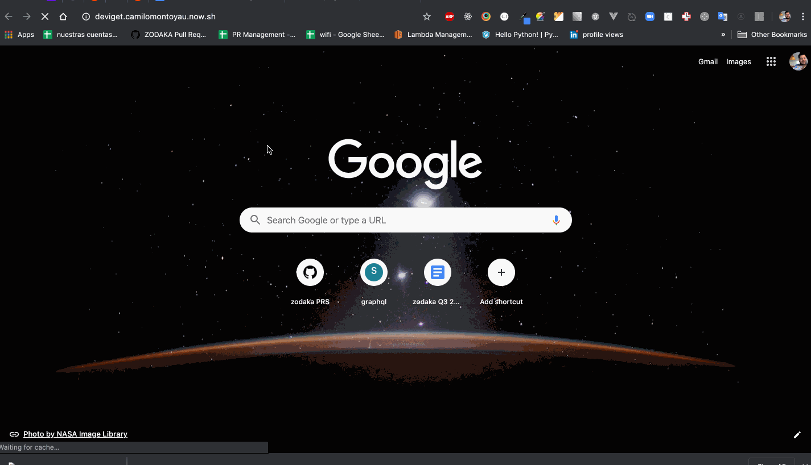

# deviget

# Description

this project is a code challenge for deviget
It reads top (trending) posts from reddit using its API

you can see the project running at
https://deviget.camilomontoyau.now.sh/



## Project setup

```
npm install
```

### Compiles and hot-reloads for development

```
npm run serve
```

### Compiles and minifies for production

```
npm run build
```

### Run your tests

```
npm run test
```

### Lints and fixes files

```
npm run lint
```

### Customize configuration

See [Configuration Reference](https://cli.vuejs.org/config/).
